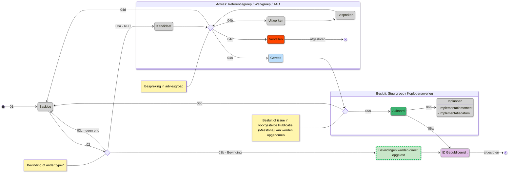

# Wijzigingsverzoeken
Repository voor het faciliteren en volgen van het wijzigingsproces. Doormiddel van het aanmaken van een issue per wijzigingsverzoek is via het project [iWlz Wijzigingsverzoeken](https://github.com/orgs/iStandaarden/projects/9) inzichtelijk wat de status van het wijzigingsverzoek is. 

## Project en status wijzigingsverzoek
In het project [iWlz Wijzigingsverzoeken](https://github.com/orgs/iStandaarden/projects/9/) is de status van een wijzigingsverzoek te volgen of te bekijken. Het proces is hieronder schematisch weergegeven.

|    # | Toelichting                                                                                                                                   |
| :--- | :-------------------------------------------------------------------------------------------------------------------------------------------- |
|   00 | Nieuwe meldingen worden verzameld bij iStandaarden Beheerteam of kunnen worden aangedragen via [Nieuw issue](https://github.com/iStandaarden/iWlz_RequestForChange/issues/new/choose) en kies het juiste type                                                                                |
|   01 | Alle issues komen op de **`Backlog`** |

## Overzicht wijzigingsverzoeken 
Het volledige overzicht van wijzigingsverzoeken is te vinden onder [Issues](https://github.com/iStandaarden/iWlz_RequestForChange/issues).

## Discussies
Discussies over een wijzigingsverzoek staan in het betreffende [Issue](https://github.com/iStandaarden/iWlz_RequestForChange/issues) of staan onder [Discussions](https://github.com/iStandaarden/iWlz_RequestForChange/discussions) indien van toepassing op het wijzigingsverzoek.

