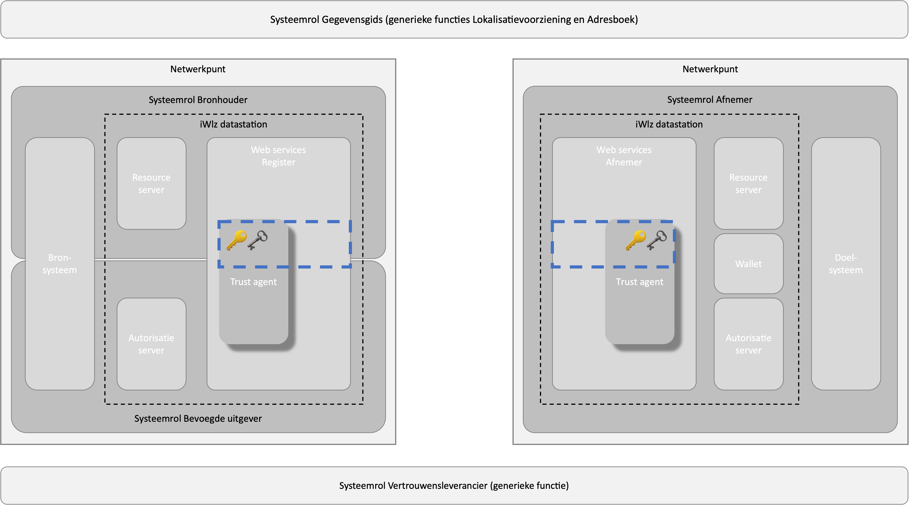

# iWlz-netwerkmodel : RFC002 Identiteit

**VERSIE:** 20-03-2023

> [!CAUTION]
> De tekst van deze RFC is opgenomen in artikel over de dienst Identificatie & authenticatie. De RFC is gebruikt om tot overeenstemming te komen, de tekst van het artikel Identificatie & authenticatie. **De tekst van het artikel is leidend.**

**Samenvatting**  
Deze RFC beschrijft hoe entiteiten in het iWlz-netwerkmodel van een verifieerbare identiteit worden voorzien. De entiteiten die hieronder vallen zijn deelnemers en dienstverleners die namens deze deelnemers optreden. De identiteit wordt verifieerbaar door gebruik te maken van sleutelmateriaal.

Identiteiten kunnen centraal (PKI) of decentraal (DPKI) worden beheerd. Het is ook mogelijk om beide vormen te combineren. Op dit moment heeft decentraal identiteitsbeheer nog niet voor alle deelnemers aan het iWlz-netwerkmodel de voorkeur. In deze RFC wordt ingezet op centraal identiteitsbeheer.

Centraal identiteitsbeheer wordt ingevuld door het toepassen van een door VECOZO beheerde public key infrastructuur (PKI).

# 1. Inleiding

Wanneer deelnemers in het iWlz-netwerkmodel gegevens willen uitwisselen en/of andere services willen gebruiken zijn betrouwbare identifiers van organisaties, services en endpoints onmisbaar. Dit is noodzakelijk om de juiste entiteiten te identificeren en veilige communicatie tussen de entiteiten te garanderen.

Daarnaast dienen toegangsrechten op basis van een geldige grondslag voor gegevensverwerking aan organisaties te worden uitgegeven. Om dit controleerbaar te doen dienen de toegangsrechten te worden ondertekend met een persoonlijke sleutel; de private sleutel.

Om digitaal te kunnen ondertekenen is een combinatie van een private- en een publieke sleutel nodig. Deze vormen een zogenaamd sleutelpaar. De publieke sleutels worden inzichtelijk gemaakt voor deelnemers.Bij het digitaal ondertekenen, worden beide gebruikt. Een ondertekenaar tekent met behulp van de private sleutel. De ontvanger kan met behulp van de bijbehorende publieke sleutel van de ondertekenaar het bericht ontcijferen en de echtheid van de handtekening controleren.

# 2. Centraal identiteitsbeheer

## 2.1 Certificate Practice Statement

Het certificaatbeheer is beschreven in het Certificate Practice Statement van VECOZO: <https://www.vecozo.nl/globalassets/documenten--downloads/over-ons/veilig-en-betrouwbaar/cp-cps-versie-3.7.pdf>

## 2.2 Aanmaken publieke sleutelparen voor authenticatie

In de communicatie tussen deelnemers en het iWlz-netwerkmodel wordt gebruik gemaakt van een sleutelpaar in de vorm van een systeemcertificaat per deelnemer. Dit systeemcertificaat wordt uitgegeven door VECOZO en ondertekend door het VECOZO-rootcertificaat. Deelnemers kunnen via de volgende link een systeemcertificaat aanvragen bij VECOZO: <https://www.vecozo.nl/support/aanvragen-wijzigen/systeem/hoe-vraag-ik-een-systeemcertificaat-aan/>.

## 2.3 Publiceren publieke sleutels voor authenticatie

De publieke sleutel van de VECOZO G4 rootcertificaat is te downloaden van de VECOZO website: <https://www.vecozo.nl/support/gebruikers-certificaten-za/algemeen/technische-informatie-over-het-werken-met-VECOZO/> (kopje “Rootcertificaat”).

## 2.4 Controle op IP-adressen

Een deelnemer kan alleen vanaf geregistreerde IP-adressen verbinding maken met het iWlz-netwerkmodel. De IP-adressen kunnen worden geregistreerd door de contactpersoon van de deelnemer. De toegang wordt geweigerd als er geen of een onjuist IP-adres is geregistreerd bij de betreffende deelnemer: <https://www.vecozo.nl/support/controle-op-ip-adressen/ip-adres-registreren/hoe-kan-ik-mijn-ip-adres-registreren>.

## 2.5 Digitaal ondertekenen van access tokens

Elk access token uitgegeven door de autorisatieserver van het iWlz-netwerkmodel aan een deelnemer of zijn dienstverlener **MOET** ondertekend zijn door de autorisatieserver van het iWlz-netwerkmodel.

De publieke sleutel van het sleutelpaar waarmee het access token is ondertekend is **NIET** publiek beschikbaar. De enige verifier van het access token is het autorisatiecomponent van het iWlz-netwerkmodel die verzoeken aan de resource server van de bronhouder verifieert.