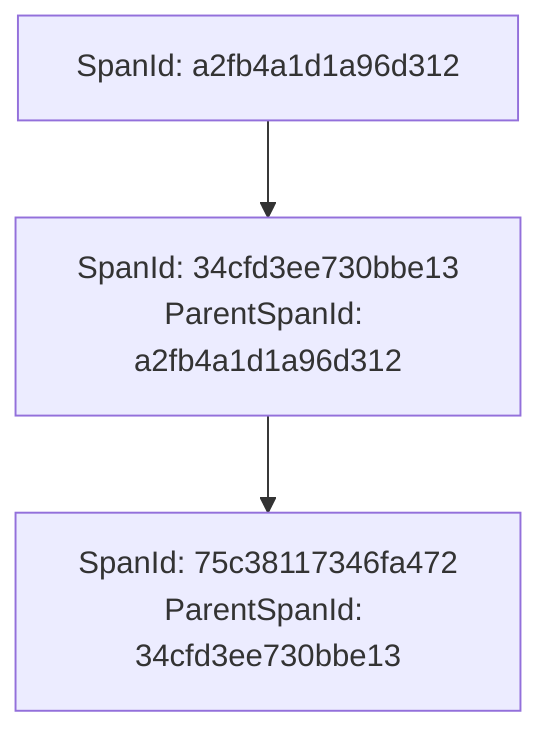

# RFC0022b - Tracelogging - ParentSpanId

> versie 0.1 d.d. 23-09-2026 — concept

<font size="4">**SAMENVATTING**</font>

**Huidige situatie:**
Binnen het iWlz-netwerkmodel is gestandaardiseerde tracelogging ingericht met `TraceId` en `SpanId`. Een `TraceId` maakt het mogelijk om verwerkingsstappen binnen dezelfde trace aan elkaar te koppelen. Een `SpanId` identificeert een afzonderlijke verwerkingsstap. De huidige afspraken leggen echter niet expliciet vast hoe de parent-childrelatie tussen spans wordt vastgelegd.

**Beoogde situatie**

De tracelogging wordt uitgebreid door de parent-childrelatie tussen spans expliciet vast te leggen conform OpenTelemetry. Bij het aanmaken van een nieuwe span wordt de ontvangen of actieve spancontext als parent gebruikt. Hierdoor kan binnen één trace worden vastgesteld welke span uit welke voorgaande span is ontstaan.

Deze RFC introduceert geen nieuwe `X-B3-ParentSpanId`-header. De parent-childrelatie wordt vastgelegd in de tracing-data volgens het OpenTelemetry-model. De bestaande `X-B3-TraceId`- en `X-B3-SpanId`-headers blijven ongewijzigd.

<font size="4">**Status RFC**</font>

Volg deze [link](https://github.com/iStandaarden/iWlz_RequestForChange/issues/251) om de actuele status van deze RFC te bekijken.

---

**Inhoudsopgave**

- [RFC0022b - Tracelogging - ParentSpanId](#rfc0022b---tracelogging---parentspanid)
- [1. Inleiding](#1-inleiding)
  - [1.1 Uitgangspunten](#11-uitgangspunten)
  - [1.2 Relatie andere RFC](#12-relatie-andere-rfc)
  - [1.3 Scope](#13-scope)
  - [1.4 Use cases](#14-use-cases)
- [2. Terminologie](#2-terminologie)
- [3. Technische uitwerking](#3-technische-uitwerking)
  - [3.1 Vastleggen van de parent-childrelatie](#31-vastleggen-van-de-parent-childrelatie)
  - [3.2 Propagation](#32-propagation)
  - [3.3 Voorbeeld](#33-voorbeeld)
- [4. Impact](#4-impact)
- [5. Voorgestelde wijziging afsprakenstelsel](#5-voorgestelde-wijziging-afsprakenstelsel)
  - [Referenties](#referenties)

---

# 1. Inleiding

Binnen het iWlz-netwerkmodel is gestandaardiseerde tracelogging verplicht. RFC0022a introduceert hiervoor `TraceId` en `SpanId`. Een `TraceId` blijft gelijk binnen een trace en maakt het mogelijk gerelateerde verwerkingsstappen aan elkaar te koppelen. Voor iedere afzonderlijke verwerkingsstap wordt een `SpanId` gebruikt.

Met alleen `TraceId` en `SpanId` kan worden vastgesteld welke spans bij dezelfde trace horen. Bij een trace met meerdere achtereenvolgende verwerkingsstappen is daardoor echter niet rechtstreeks zichtbaar welke span de parent is van een volgende span.

Deze RFC werkt de eerder in [RFC0022a](https://github.com/iStandaarden/iWlz_RequestForChange/issues/263) aangekondigde uitbreiding met `ParentSpanId` uit. De uitbreiding sluit aan op het tracingmodel van OpenTelemetry en introduceert geen iWlz-specifiek mechanisme voor het genereren of transporteren van een `ParentSpanId`.

## 1.1 Uitgangspunten

Voor deze RFC gelden de volgende uitgangspunten:

* De bestaande toepassing van `TraceId` en `SpanId` uit [RFC0022a](https://github.com/iStandaarden/iWlz_RequestForChange/issues/263) blijft ongewijzigd.
* Partijen gebruiken de OpenTelemetry SDK voor tracelogging conform de bestaande afspraken.
* Een nieuwe span wordt aangemaakt binnen de ontvangen of actieve spancontext.
* De ontvangen of actieve span wordt daarmee de parent van de nieuw aangemaakte span.
* De parent-childrelatie wordt conform OpenTelemetry vastgelegd in de tracing-data.

## 1.2 Relatie andere RFC

Deze RFC heeft een relatie met de volgende RFC(s):

| RFC      | onderwerp                        | relatie<sup>*</sup> | toelichting                                                                                                                                | issue                                                       |
| :------- | :------------------------------- | :------------------ | :----------------------------------------------------------------------------------------------------------------------------------------- | :---------------------------------------------------------- |
| RFC0022a | Tracelogging - TraceID en SpanID | afhankelijk         | Deze RFC bouwt voort op de in RFC0022a geïntroduceerde `TraceId` en `SpanId` en werkt de aangekondigde uitbreiding met `ParentSpanId` uit. | [issue](https://github.com/iStandaarden/iWlz-RFC/issues/37) |

<sup>*</sup>voorwaardelijk, *voor andere RFC* / afhankelijk, *van andere RFC*

## 1.3 Scope

Binnen scope van deze RFC vallen:

* het expliciet vastleggen van de parent-childrelatie tussen spans binnen één trace;
* het gebruik van de ontvangen of actieve spancontext als parent bij het aanmaken van een nieuwe span;
* aansluiting op het OpenTelemetry-tracingmodel;
* verduidelijking van de relatie tussen `TraceId`, `SpanId` en `ParentSpanId`.

## 1.4 Use cases

* **Use case 1: opeenvolgende verwerkingsstappen:** Binnen één trace worden meerdere services aangeroepen. Door de parent-childrelatie vast te leggen kan worden vastgesteld welke span uit welke voorgaande span is ontstaan.
* **Use case 2: incidentanalyse:** Bij analyse van een productie-incident kan niet alleen worden vastgesteld welke spans bij dezelfde trace horen, maar ook wat de onderlinge relatie tussen opeenvolgende spans is.

# 2. Terminologie

Onderstaande tabel geeft aan of een begrip al in de iWlz-begrippenlijst is opgenomen, nieuw moet worden toegevoegd of moet worden geactualiseerd.

| Terminologie        | Omschrijving                                                                                                                                                                                                                        | Status begrippenlijst |
| :------------------ | :---------------------------------------------------------------------------------------------------------------------------------------------------------------------------------------------------------------------------------- | :-------------------- |
| `TraceId`           | Unieke identifier die bij het starten van een ketenverzoek wordt gegenereerd en aan alle opvolgende diensten wordt doorgegeven, zodat alle logregels van hetzelfde verzoek aan elkaar te koppelen zijn.                             | Bestaand              |
| `SpanId`            | Unieke identifier per afzonderlijke verwerkingsstap binnen een keten, waarmee de verwerking stap voor stap gevolgd kan worden.                                                                                                      | Bestaand              |
| `ParentSpanId`      | De `SpanId` van de span die als parent geldt voor een nieuwe span. Hiermee wordt de parent-childrelatie tussen spans vastgelegd.                                                                                                    | Nieuw                 |
| span                | Een afzonderlijke verwerkingsstap binnen een trace.                                                                                                                                                                                 | Nieuw                 |
| spancontext         | De tracingcontext van een span, waaronder de `TraceId` en `SpanId`, die wordt gebruikt om tracing over systeem- en servicegrenzen heen voort te zetten.                                                                             | Nieuw                 |
| parent-childrelatie | De relatie waarbij een nieuwe span voortkomt uit een bestaande span.                                                                                                                                                                | Nieuw                 |
| OpenTelemetry       | Standaard en tooling voor onder andere distributed tracing. Binnen iWlz wordt de OpenTelemetry SDK gebruikt voor het genereren van `TraceId`- en `SpanId`-waarden en voor het vastleggen van de spancontext en parent-childrelatie. | Actualiseren          |
| B3 Propagation      | Standaard voor het doorgeven van trace-informatie via HTTP-headers (`X-B3-TraceId` en `X-B3-SpanId`) bij elk verzoek binnen het netwerkmodel.                                                                                       | Bestaand              |

# 3. Technische uitwerking

## 3.1 Vastleggen van de parent-childrelatie

Bij het aanmaken van een nieuwe span wordt de ontvangen of actieve spancontext als parent gebruikt. Hierdoor wordt de parent-childrelatie tussen spans binnen dezelfde trace vastgelegd. De parent-childrelatie wordt conform OpenTelemetry vastgelegd.

De `TraceId` blijft voor alle spans binnen dezelfde trace gelijk. Iedere nieuw aangemaakte span krijgt een eigen `SpanId`. De `SpanId` van de parent wordt als parentrelatie aan de nieuwe span gekoppeld.

Hierdoor kan naast correlatie op `TraceId` ook de onderlinge relatie tussen opeenvolgende spans worden gereconstrueerd.

## 3.2 Propagation

De bestaande afspraken voor het doorgeven van tracecontext blijven van toepassing:

* `X-B3-TraceId` bevat de `TraceId` van de trace;
* `X-B3-SpanId` bevat de `SpanId` van de actieve span die met het verzoek wordt doorgegeven.

Bij ontvangst van het verzoek wordt deze spancontext gebruikt als parentcontext voor de nieuwe span. Voor de nieuwe verwerkingsstap wordt een nieuwe `SpanId` aangemaakt.

> [!IMPORTANT]
> `ParentSpanId` beschrijft de relatie tussen spans binnen OpenTelemetry en wordt **niet** als afzonderlijke header aan het verzoek toegevoegd. Deze RFC introduceert dus geen `X-B3-ParentSpanId`-header.

## 3.3 Voorbeeld

Een service ontvangt een verzoek met de volgende tracecontext:

```text
TraceId: 463ac35c9f6413ad48485a3953bb6124
SpanId: a2fb4a1d1a96d312
```

Voor de eigen verwerking maakt de service een nieuwe span aan. De `TraceId` blijft gelijk en de ontvangen span wordt als parent vastgelegd:

```text
TraceId: 463ac35c9f6413ad48485a3953bb6124
SpanId: 34cfd3ee730bbe13
ParentSpanId: a2fb4a1d1a96d312
```

Hiermee wordt vastgelegd dat span `34cfd3ee730bbe13` een child is van span `a2fb4a1d1a96d312`.

De relatie kan als volgt worden weergegeven:

**TraceId:** `463ac35c9f6413ad48485a3953bb6124`



# 4. Impact

De OpenTelemetry SDK is op basis van [RFC0022a](https://github.com/iStandaarden/iWlz-RFC/issues/37) reeds verplicht voor tracelogging. Deze RFC introduceert daarmee geen nieuwe technische standaard.

De implementatie-impact kan per softwareleverancier verschillen. Per implementatie moet worden vastgesteld of de parent-childrelatie al conform OpenTelemetry wordt vastgelegd of dat hiervoor aanvullende configuratie of aanpassing noodzakelijk is.

# 5. Voorgestelde wijziging afsprakenstelsel

Voorgesteld wordt om in het onderdeel **Tracelogging**, bij de technische afspraken over OpenTelemetry, na de bestaande passage over het genereren van een nieuwe `SpanId` de volgende tekst toe te voegen:

> Bij het aanmaken van een nieuwe span wordt de ontvangen of actieve spancontext als parent gebruikt. Hierdoor wordt de parent-childrelatie tussen spans binnen dezelfde trace vastgelegd. De parent-childrelatie wordt conform OpenTelemetry vastgelegd.
>
> **Voorbeeld**
> Een service ontvangt een verzoek met:
>
> `TraceId: 463ac35c9f6413ad48485a3953bb6124`
> `SpanId: a2fb4a1d1a96d312`
>
> Voor de eigen verwerking maakt de service een nieuwe span aan. De `TraceId` blijft gelijk en de ontvangen span wordt als parent vastgelegd:
>
> `TraceId: 463ac35c9f6413ad48485a3953bb6124`
> `SpanId: 34cfd3ee730bbe13`
> `ParentSpanId: a2fb4a1d1a96d312`
>
> Hiermee wordt vastgelegd dat span `34cfd3ee730bbe13` een child is van span `a2fb4a1d1a96d312`.
>
> **Let op:** `ParentSpanId` beschrijft de relatie tussen spans binnen OpenTelemetry en wordt niet als afzonderlijke header aan het verzoek toegevoegd.

---

## Referenties

* [OpenTelemetry documentation](https://opentelemetry.io/docs/)
* [OpenTelemetry Trace API](https://opentelemetry.io/docs/specs/otel/trace/api/)
* [OpenTelemetry Context Propagation](https://opentelemetry.io/docs/concepts/context-propagation/)
* [B3 Propagation](https://github.com/openzipkin/b3-propagation)
