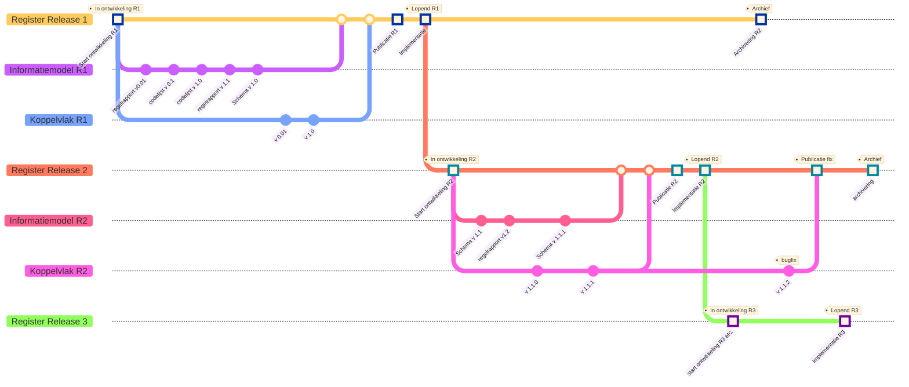
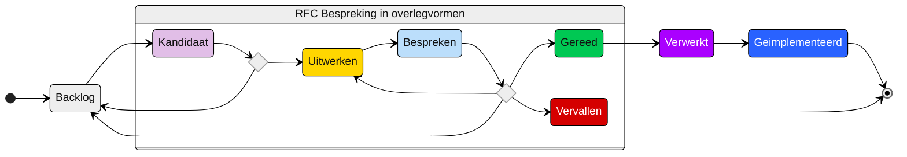
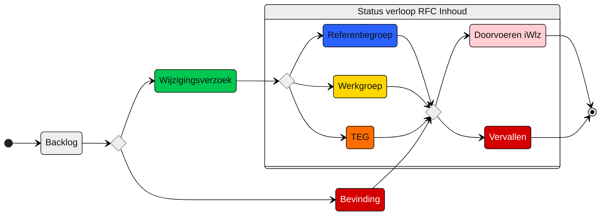

```mermaid
---
config:
  logLevel: debug
  theme: base
  gitGraph:
    showBranches: true
    showCommitLabel: true
    mainBranchName: Register Release 1
    parallelCommits: false
---
gitGraph
        commit id: "Start ontwikkeling R1" type: HIGHLIGHT tag: "In ontwikkeling R1"
        branch "Informatiemodel R1"
        branch "Koppelvlak R1"
        checkout "Informatiemodel R1"        
        commit id: "regelrapport v0.01"
        commit id: "codelijst v 0.1"
        commit id: "codelijst v 1.0"
        commit id: "regelrapport v 1.1"
        commit id: "Schema v 1.0"
        checkout "Koppelvlak R1"
        commit id: "v 0.01"
        commit id: "v 1.0"
        checkout "Register Release 1"
        merge "Informatiemodel R1"
        merge "Koppelvlak R1"
        commit id: "Publicatie R1" type: HIGHLIGHT
        commit id: "Implementatie" type: HIGHLIGHT tag: "Lopend R1"
        branch "Register Release 2"
        checkout "Register Release 2"
        commit id: "Start ontwikkeling R2" tag: "In ontwikkeling R2" type: HIGHLIGHT
        branch "Informatiemodel R2"
        branch "Koppelvlak R2"
        checkout "Informatiemodel R2"
        commit id: "Schema v 1.1"
        commit id: "regelrapport v1.2"
        checkout "Koppelvlak R2"
        commit id: "v 1.1.0"
        checkout "Informatiemodel R2"
        commit id: "Schema v 1.1.1"
        checkout "Koppelvlak R2"
        commit id: "v 1.1.1"
        checkout "Register Release 2"
        merge "Informatiemodel R2"
        merge "Koppelvlak R2"
        commit id: "Publicatie R2" type: HIGHLIGHT
        commit id: "Implementatie R2" tag: "Lopend R2" type: HIGHLIGHT
        branch "Register Release 3"
        commit id: "start ontwikkeling R3 etc." tag: "In ontwikkeling R3" type: HIGHLIGHT
        checkout "Register Release 1"
        commit id: "Archivering R2" type: HIGHLIGHT tag: "Archief"
        checkout "Koppelvlak R2"
        commit id: "v 1.1.2" tag: "bugfix" 
        checkout "Register Release 2"
        merge "Koppelvlak R2" type: HIGHLIGHT tag: "Publicatie fix"
        checkout "Register Release 3"
        commit id: "Implementatie R3" tag: "Lopend R3" type: HIGHLIGHT
        checkout "Register Release 2"
        commit id: "archivering" type: HIGHLIGHT tag: "Archief"
```

```mermaid
---
config:
  theme: neutral
  look: classic
  layout: dagre
---
stateDiagram
  direction LR
    [*] --> Backlog
  Backlog --> Kandidaat
  state ProcesStatus {
    direction TB
    state candidate <<choice>>
    Kandidaat --> candidate
    candidate --> Uitwerken
    Uitwerken --> Bespreken
    state readiness <<choice>>
    Bespreken --> readiness
    readiness --> Uitwerken
    readiness --> Gereed
    readiness --> Vervallen
    candidate
    Kandidaat
    Uitwerken
    Bespreken
    readiness
    Gereed
  }
  readiness --> Backlog
  candidate --> Backlog
  Gereed --> Verwerkt
  Verwerkt --> Geimplementeerd
  Geimplementeerd --> [*]
  Vervallen --> [*]
  ProcesStatus: RFC Bespreking in overlegvormen
  style Kandidaat fill:#E1BEE7
  style Uitwerken fill:#FFD600
  style Bespreken fill:#BBDEFB,color:none
  style Gereed fill:#00C853
  style Vervallen fill:#D50000,color:#FFFFFF
  style Verwerkt fill:#AA00FF,color:#FFFFFF
  style Geimplementeerd fill:#2962FF,color:#FFFFFF
```

```mermaid
---
config:
  theme: neutral
  look: classic
  layout: dagre
---
stateDiagram
  direction LR
  state issue_type <<choice>>
  state RFCInhoud {
    direction TB
    state rfc_type <<choice>>
    rfc_type --> Referentiegroep
    rfc_type --> Werkgroep
    rfc_type --> TEG
    state rfc_decision <<choice>>
    Referentiegroep --> rfc_decision
    Werkgroep --> rfc_decision
    TEG --> rfc_decision
    rfc_decision --> Doorvoeren
    rfc_decision --> Vervallen
    rfc_type
    Referentiegroep
    Werkgroep
    TEG
    rfc_decision
    Doorvoeren
  }
  [*] --> Backlog
  Backlog --> issue_type
  issue_type --> Wijzigingsverzoek
  issue_type --> Bevinding
  Wijzigingsverzoek --> rfc_type
  Bevinding --> rfc_decision
  
  Doorvoeren --> [*]
  Vervallen --> [*]
  Doorvoeren:Doorvoeren iWlz
  RFCInhoud:Status verloop RFC Inhoud
  style Referentiegroep fill:#2962FF
  style Werkgroep fill:#FFD600
  style TEG fill:#FF6D00
  style Doorvoeren fill:#FFCDD2
  style Wijzigingsverzoek fill:#00C853
  style Bevinding,Vervallen fill:#D50000,color:#FFFFFF
```